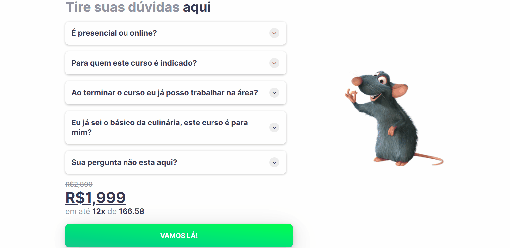

# **Diplôme Ratatouille**

## **Hello and welcome** 👋🏻
## I created this site to test an element I learned recently, the FAQ block. The idea came to use it on a course website so I created the 🧀Diplôme Ratatouille🐀, which is a world-renowned professional gastronomic course.
#### Criei esse site para testar um elemento que aprendi recentemente, o bloco de perguntas frequentes. Me veio a ideia de usá-lo em um site de curso então criei o 🧀Diplôme Ratatouille🐀, que é um curso gastronomico profissional mundialmente conhecido.
## **[Access Here]()**

## **FAQ result**

### **Technologies Used**
- **HTML**
- **CSS**
- **Javascript**
## If you don't know me, **I'm Fabrício🤙🏻**, I'm from Brazil and I'm a programming student 👨🏻‍💻 focused on FRONT-END and Web Designer. 
## **⬇Made by My⬇**
